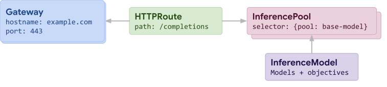

# Understanding the Inference Extension Guide

The GW API inference extension has [a guide] (https://gateway-api-inference-extension.sigs.k8s.io/guides) demonstrating how the extension works.

The idea is to setup in a Kubernetes cluster a mechanism to route traffic to backend LLMs.

## Prerequisites

- amd64 CPU architecture (required by vLLM).
- Lots of CPU and RAM.
- Tools:  kubectl, helm

## A k8s cluster

I chose k3d:

```shell
k3d cluster create my-k8s-cluster \
    --api-port 6443 \
    --k3s-arg "--disable=traefik@server:0" \
    --port 80:80@loadbalancer \
    --port 443:443@loadbalancer
```

## Envoy Gateway

The guide uses [Envoy Gateway](https://gateway.envoyproxy.io/).

```shell
helm install eg oci://docker.io/envoyproxy/gateway-helm \
  --version v1.3.1 \
  -n envoy-gateway-system --create-namespace
```

It's interesting to point out that Envoy Gateway will automatically install the Kubernetes GW API CRDs as part of its installation.  So no need to do that explicitly.

```shell
k api-resources --api-group=gateway.networking.k8s.io
```

### Enable Patch Policy

This step is mostly artificial, or an artifact of Envoy Gateway conventions:  by default Envoy Gateway does not permit the application of policies that configure a gateway directly.

All we are doing is telling Envoy Gateway through configuration:  enable it.

```yaml title="enable-patch-policy.yaml"
--8<-- "enable-patch-policy.yaml"
```

```shell
k apply -f enable-patch-policy.yaml
```

After the ConfigMap is revised, the deployment must be restarted to pick up the change:

```shell
k rollout restart deployment envoy-gateway -n envoy-gateway-system
```

### Gateway Class

The installation of Envoy Gateway does not automatically beget a GatewayClass.

So let's go ahead and create it:

```yaml title="gateway-class.yaml"
--8<-- "gateway-class.yaml"
```

```shell
k apply -f gateway-class.yaml
```

## Provision a Gateway

```yaml title="gateway.yaml"
--8<-- "gateway.yaml"
```

The configuration is straightforward: the gatewayClassName points to the eg gateway class.

It's curious that two listeners are configured, presumably to demonstrate that you can segregate LLM requests from non-LLM requests.  In other words, dedicate a listener for LLM requests named `llm-gw`.

```shell
k apply -f gateway.yaml
```

## Deploy an LLM worload

The guide offers two options.  We opt for the cpu deployment option.

```yaml title="cpu-deployment.yaml"
--8<-- "cpu-deployment.yaml"
```

The cpu deployment option uses a relatively small model:  [`Qwen/Qwen2.5-1.5B-Instruct`](https://huggingface.co/Qwen/Qwen2.5-1.5B-Instruct).
This model is not gated and so does not require a Hugging Face token.

The container requires 12 cpus and 9Gi of memory (see the `resources` section).

The perhaps important thing to note about the running container is that it supposedly configures two models, `tweet-summary-0` and `tweet-summary-0` through lora adapters that extend the base model.

The default deployment sets 3 replicas which requires a lot of resources.
So I set my manifest to use just one replica.

```shell
k apply -f cpu-deployment.yaml
```

Allow 5-10 minutes before the pod is up and running.

## Inference Extension CRDs

The inference extension provides two new resources: [InferencePool](https://gateway-api-inference-extension.sigs.k8s.io/api-types/inferencepool/) and [InferenceModel](https://gateway-api-inference-extension.sigs.k8s.io/api-types/inferencemodel/) for configuring different facets of routing to LLM backends.

The cluster needs to know about these resources:

```shell
k apply -f crds/
```

## Install the extension

```yaml title="inference-extension.yaml"
--8<-- "inference-extension.yaml"
```

```shell
k apply -f inference-extension.yaml
```

## Hook in the extension

To hook the extension into the flow of requests through the gateway's `llm-gw` listener on port 8081, we define a ficticious backend and a route to it:

```yaml title="backend-and-route.yaml"
--8<-- "backend-and-route.yaml"
```

Note that the route has no match clause, meaning any request to that listener matches.

```shell
k apply -f backend-and-route.yaml
```

Next, we define an EG extension policy:

```yaml title="extension-policy.yaml"
--8<-- "extension-policy.yaml"
```

The extension policy achieves two things:

1. It makes EG aware of the inference extension you just deployed through the `extProc` section, and
1. It attaches the extension to the above route

```shell
k apply -f extension-policy.yaml
```

## Envoy Patch Policy

The guide also applies an Envoy patch policy.

```yaml title="patch-policy.yaml"
--8<-- "patch-policy.yaml"
```

I don't really understand what this policy does or its purpose, if it circumvents a bug, or what.

```shell
k apply -f patch-policy.yaml
```
 
## Configure the extension

Now that the extension is in the path of requests, we need to give it the information it needs to do its job:  it needs to know about the backend LLMs, associate model names to each, and other metadata such as "criticality" in order to know the relative importance of the different models.

### The InferencePool

```yaml title="inference-pool.yaml"
--8<-- "inference-pool.yaml"
```

Thename of the pool is set to `vllm-llama2-7b`.

The InferencePool resource appears to be concerned primarily with more practical aspects of how to route to the LLM workload:

1. What port does it run (`targetPortNumber`), and 
1. How do I select or identify the workload (`selector`)

```shell
k apply -f inference-pool.yaml
```

### The InferenceModel

```yaml title="inference-model.yaml"
--8<-- "inference-model.yaml"
```

The model achieves the following:

1. Any requests specifying the model "tweet-summary" will match this inference model
1. This model is marked with a `criticality` of Critical
1. This model is associated with the above inference pool, meaning that matching requests will be routed to our cpu deployment
1. Through `targetModels` we are configuring which of the two extension models ("tweet-summary-0" or "tweet-summary-1") to target, or what weight distributions to give to each.


```shell
k apply -f inference-model.yaml
```



## Test it

Everything is now in place:  requests can be sent in to the gateway, the inference extension will be consulted, it will inspect the request, note the model `tweet-summary` in the request, which will match the above InferenceModel, resulting in the request being routed to the `tweet-summary-1` model running as part of the cpu deployment we deployed earlier.

I suspect that the name "llama2-7b" is an artifact of perhaps a prior attempt to make this exercise work with a different model.  The model was revised to Qwen-1.5B but the name of the deployment and associated labels were never updated to match?

Capture the gateway ip address to the environment variable `GW_IP`:

```shell
export GW_IP=$(kubectl get gtw inference-gateway -o jsonpath='{.status.addresses[0].value}')
```

Send a request:

```shell
curl $GW_IP:8081/v1/completions -H 'Content-Type: application/json' -d '{
  "model": "tweet-summary",
  "prompt": "Write as if you were a critic: San Francisco",
  "max_tokens": 100,
  "temperature": 0
}' | jq
```
